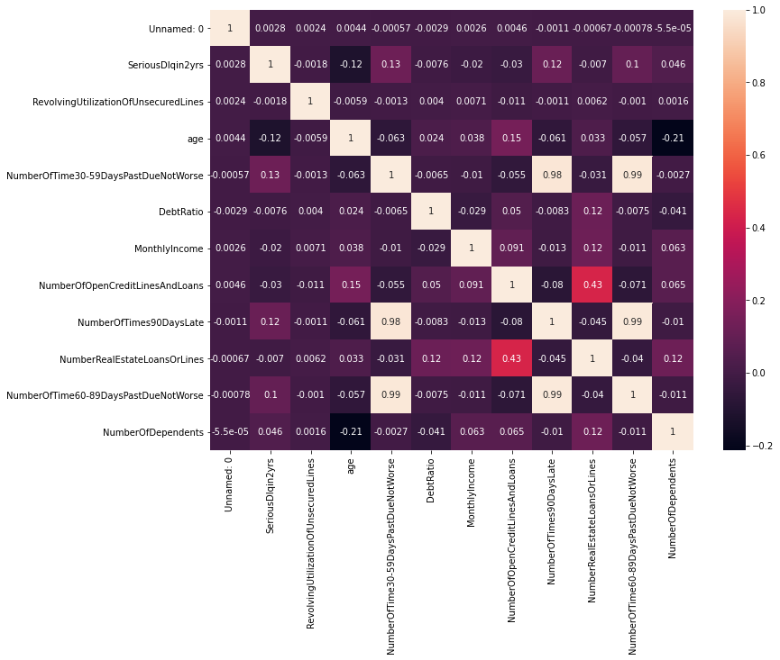
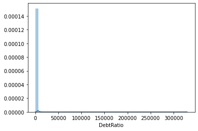
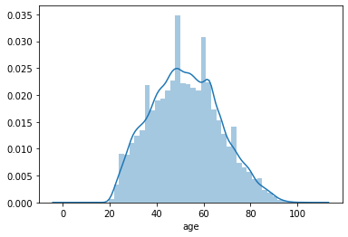
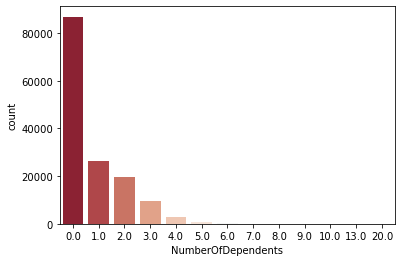
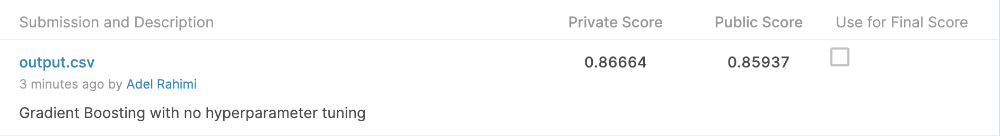

# kaggle_credit 
Codes for Kaggle competition "Give me some credit"

This repository contains codes and notebooks for the Kaggle competition titled "Give me some credit". [1]
This competition is expected to use some financial data of people and predict if they are likely to face financial issues or not.
The task is set to use AUC as it is an informative method to evaluate binary classification.

# Questions to answer
Below we will answer some questions regarding methodology and metrics
## Why AUC-ROC?

Area Under the Curve of the Receiver Operator Characteristic shows how well our binary classifier can distinguish between our two classes.
This comes handy as we want to know what is the True Positive Rate (TPR) and False Positive Rate (FPR) of our model and this one figure will give us the answer to both.
An important reason for using AUC-ROC is that since our data is imbalanced the model can get a high precision only with predicting the whole validation data as 0. Which we know is not a correct behavior.  

Other potential metric to use:

1) Logloss: To penalize our model on the prediction when it is certain our some predictions.
This loss is implemented in sklearn as: sklearn.metrics.log_loss and can be calculated as:
`log_loss = -(y * log(y_hat) + (1-y) * (1-y_hat))`. Where y is true label and y_hat is prediction from the model

2) MSE: Mean Squared Error or in short MSE is another metric to evaluate our regression model.
It is basically how far our prediction is from the true value.
`MSE = (y_hat - y)**2`
MSE can be used alongside MSE for a better understanding of model's performance.

Others: Cohen-Kappa score is a measure to say how much two annotators agree on an annotation. It can be used a measure for our model. F1 score, harmonic mean between precision and recall can also be used. 

## How to validate the model?
In order to validate the model I have used K-fold cross-validation as it a well-known robust method to the model validation.
In this method we will do the following:
 1) Shuffle the dataset
 2) Split the dataset into k different folds
 3) Dor each fold:
    1) Take the group as validation set
    2) Train the model on the other group
    3) Predict the current group and calculate the loss/evaluation metric
 4) Summarize (Maybe average) over the whole k folds.
 
 I have used this method because it 1) Shuffles the data so that we won't end up with easy validation set (maybe the last 20% of the dataset is easy). 2) Uses all the training dataset as evaluation so this will give us a better understanding of model generalization.
 
# Introduction to repository

The directory structure of the repository is as follow:

```
kaggle_credit
│   README.md - This file
|   Makefile - Makefile build automation directions  
|   Requirements.txt - Requirements file
|   final_submission.csv - The outputs from the final submission
|   Dockerfile - Dockerfile to build the image from 
|   .gitignore - All the files to be ignored by git  
│
└───figures - Directory containing graphs and figures
│      submission_score.png - My submission score 
│
└───notebooks - Directory containing notebooks 
│      data_exploration.ipynb: Showing different statistics on the data
|      feature_selection_rf.ipynb: Finding the most important features using Randomforest
|      final_model.ipynb: The latest submission using GradientBoosting
|      gb_gridsearch.ipynb: Gridsearching through GradientBoosting hyperparameters
|      rf_model_feature_importances.ipynb: Training a model with only the most important features previously extracted from Randomforest 
|      using_all_data.ipynb: Using all the columns for training
|      gb_iterative_imputator.ipynb : Using GradientBoosting and iterative imputator 
|      gb_knn_imputator.ipynb : KNN imputator 
└───data - Directory containing all the data 

```

There are multiple notebooks in the notebooks directory that contain the different approaches that I have taken.

# Data Analysis
In order to analyse the data I have used pandas and some simple statistics to understand how the data is distributed.

## Labels balance
> related notebook: `notebooks/data_exploration.ipynb`

In order to check if we have a balanced or unbalanced dataset. I have grouped the datapoints by the count of labels (SeriousDlqin2yrs).
Turned out that we have the following data:
```
SeriousDlqin2yrs
0    139974
1     10026

```
This is something that I can later look at. Maybe using a balanced bagging classifier could be a good idea.

## Correlation
Below is a heatmap of the correlation of the variables



## DebtRatio skewedness

The DebtRatio is very skewed as the std of the data is 2037 and the plot looks like this:



A similar skewedness pattern can be observed in RevolvingUtilizationOfUnsecuredLines as well.

## Age 
Age distribution does not see any skewedness.  



## Number of dependents 

Number of dependents has a mode of 0 and mean of 0.7. 




## Explaining important features using RandomForest
>Related notebook: `notebooks/feature_selection_rf.ipynb`

In order to find out the top features we use RandomForest as it is an explainable model and look at the top features it uses to predict the datapoints:

```python
{'RevolvingUtilizationOfUnsecuredLines': 0.19221123680189298,
 'age': 0.12171943243752772,
 'NumberOfTime30-59DaysPastDueNotWorse': 0.03604861933861011,
 'DebtRatio': 0.19444260090080842,
 'MonthlyIncome': 0.14865628566881625,
 'NumberOfOpenCreditLinesAndLoans': 0.08066758193948617,
 'NumberOfTimes90DaysLate': 0.12786316249439175,
 'NumberRealEstateLoansOrLines': 0.03018097017039138,
 'NumberOfTime60-89DaysPastDueNotWorse': 0.02865017488715702,
 'NumberOfDependents': 0.0395599353609183}
```
> Note: As Sklearn documentations has suggested: impurity-based feature importances can be misleading for high cardinality features (many unique values)

Based on the results above the top features are:

```
 'age': 0.12171943243752772,
 'NumberOfTimes90DaysLate': 0.12786316249439175,
 'MonthlyIncome': 0.14865628566881625,
 'RevolvingUtilizationOfUnsecuredLines': 0.19221123680189298,
 'DebtRatio': 0.19444260090080842
```
 
## Training models only on top features
> Related notebook: `notebooks/feature_selection_rf`

Now we want to train a model only on the important features. Based on my previous experience this method, sometimes, yields
very good results. After training RF and Gradient Boosting models. I came to the conclusion that this method of feature selection was not suitable.

## Hyperparameter tuning for Gradient Boosting
> Related notebook: `notebooks/gb_gridsearch`

For this section, I tried to use all the features with our Gradient Boosting model and try to use grid search to find the best parameters for the model.

Note: As I don't have enough resources this experiment is still on-going.

## Iterative Imputator
> Related notebook: `nootebooks/gb_iterative_imputator.ipynb`

This is a cool new method to predict nan values based on other features. For this experiment I used the Sklearn experimental feature known as iterative imputations but the result was not very promising.

```python

import numpy as np
from sklearn.experimental import enable_iterative_imputer
from sklearn.impute import IterativeImputer

imp_mean = IterativeImputer()
x_test = imp_mean.fit_transform(x_test)

```

## KNN Imputator
> Related notebooks: `notebooks/gb_knn_imputator.ipynb`

For this test we use K nearest neighbours as a data imputation method. The results were not very promising.


# Final Model
> Related notebooks: `notebooks/final_model.ipynb`
 
For the final model, I have used GradientBoosting model as it has performed much better than others.
The final parameters of the model are as follows:
1) Loss = ls
2) n_estimators = 300 (it is a high number but as GB is robust to overfitting, so we're good!)

I did not have much time for hyperparameter search or feature selection therefore my final score is a quite normal score.
I got 85.9 on the public leaderboard and 86.6 on the private leaderboard.


 
## How to score more?
As the scores for this task are quite close and there are a lot of submissions that have gotten more or less the same score. 
I would narrow down the further experiments into two parts:
1) Feature selection: We can further explore the data and select different features for our inputs
2) Grid search: Using high resources we can Gridsearch through different hyperparameters and find the best one that can improve our score 
3) MICE: I have not used median for Nan replacement as I didn't have much time over the weekend. I suggest that we can use MICE to replace the missing values


# How to run?
In this section we will go through running the project and using the notebooks.
## Docker
In order to use the project in a docker environment, simply use the commands: 
1) make build
2) make run_docker
3) Open browser and go to: http://127.0.0.1:8765
## Python
In order to run the project on your own computer using your own environment or conda kindly use the `make run`
command. Otherwise, run it using docker.
# Requirements
All the requirements are written in the requirements.txt file.
# Ideas
1) BaggingClassifier
2) Refactor the docker image
3) Refactor the Makefile
4) Remove the idea and DS_Store files and clean up the repository

# References
[1] https://www.kaggle.com/c/GiveMeSomeCredit/